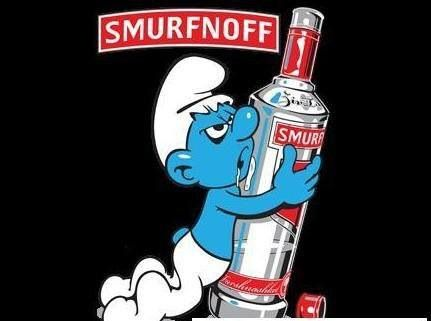
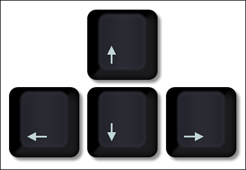

# Team "Athenae", teamwork project - "The Drunken Smurf"
# Javascript UI and DOM - March, 2017
----------------------------------

## Team members:

 1. Lamma - Лиляна Бабачева
 2. Martina_Shebova - Мартина Шебова
 3. Milen_Tanev - Милен Танев
 4. AngelK99 - Ангел Кузев
 5. Encho Enevski - encho.enevski
 6. Simeon_Gerginov - Симеон Гергинов
 7. Petar.Yanev - Петър Янев
 8. DarkDawn - Иван Иванов

## GitHub repository
https://github.com/LammaSF/Athena

## Telerik Academy Showcase System place
http://best.telerikacademy.com/

## Project description
This project is a simple implementation of the game "The Drunken Smurf".

The game is operated through arrow keys and is a single-player game.

